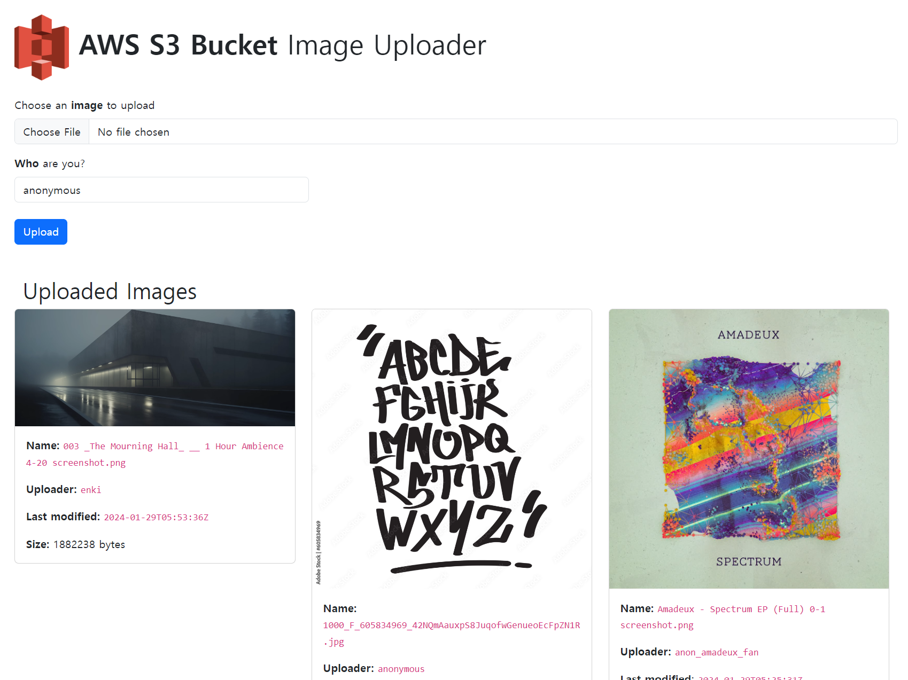
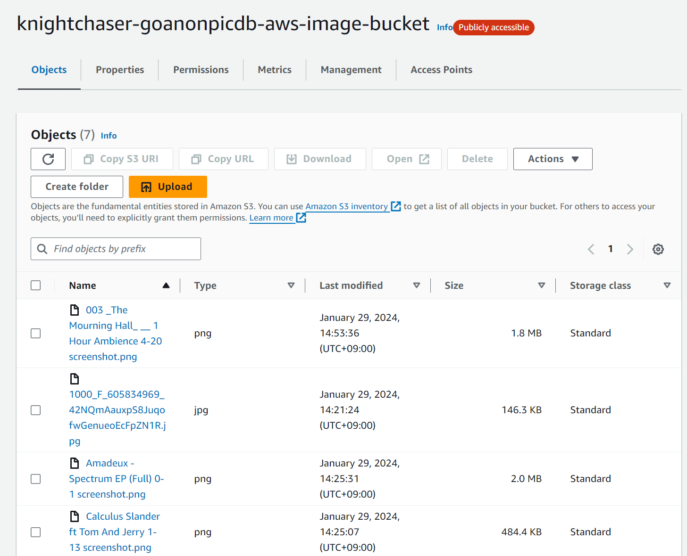

# goAnonPicDB-AWS


**goAnonPicDB-AWS** is a variant of **[`KnightChaser/goAnonPicDB`](https://github.com/KnightChaser/goAnonPicDB)**, which is a simple web service that allows users to anonymously upload images. **Amazon AWS S3 Bucket** associated with the account and bucket described in `/.env`(environment variable file) will store the images that users uploaded and the server written in Go(using `gin` web framework) will interact with the cloud service. Yes, S3 is like CDN(Content Delivery Network) in this project.

**CI/CD status**: [](https://github.com/KnightChaser/goAnonPicDB-AWS/actions/workflows/main.yml)

## Preview
User interactive page running on `localhost:[YOUR_OWN_PORT_NAME]`

AWS S3 that stores the images that users (anonymously) uploaded


## Run

To run this project, create a file named `.env` at `/`(top directory) of the project file

```env
AWS_ACCESS_KEY_ID=[YOUR_AWS_ACCCESS_KEY]
AWS_SECRET_ACCESS_KEY=[YOUR_AWS_SECRET_ACCESS_KEY]
AWS_REGION=[YOUR_AWS_S3_BUCKET_REGION]
S3_BUCKET_NAME=[YOUR_S3_BUCKET_NAME]
CLIENT_WEB_ACCESS_PORT=[YOUR_OWN_PORT_NAME]
```

The accessible link will be `localhost:${CLIENT_WEB_ACCESS_PORT}`. (e.g. `localhost:8080`)

Make sure that Amazon AWS S3 Bucket has appropriate granted access. For example, you can publicly open your S3 Bucket so everyone can see the images uploaded on the cloud. (Below is such configuration for `Amazon S3 > Permissions > Bucket Policy`)
```json
{
    "Version": "2012-10-17",
    "Statement": [
        {
            "Sid": "Stmt1405592139000",
            "Effect": "Allow",
            "Principal": "*",
            "Action": "s3:*",
            "Resource": [
                "arn:aws:s3:::[YOUR_AWS_S3_BUCKET_NAME]/*",
                "arn:aws:s3:::[YOUR_AWS_S3_BUCKET_NAME]"
            ]
        }
    ]
}
```

## Future work
- [X] Dockerizing applications
- [ ] Integrate automatic Docker deployment with GitHub Workflow
- ~~[ ] After dockerization, test and deploy this application to Amazon EC2~~


## Contribution
Always welcome, because you might have better idea